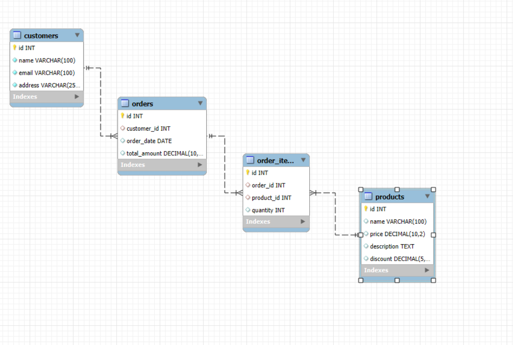

This project simulates a basic e-commerce database using MySQL. It includes functionality to manage 
* Customers
* Products
* Orders

Errors:

1054: double check table aliases and column names.
1175: safe update mode 

Notes:

1.Always use table aliases.
2.Verify foreign keys are correctly referenced.

